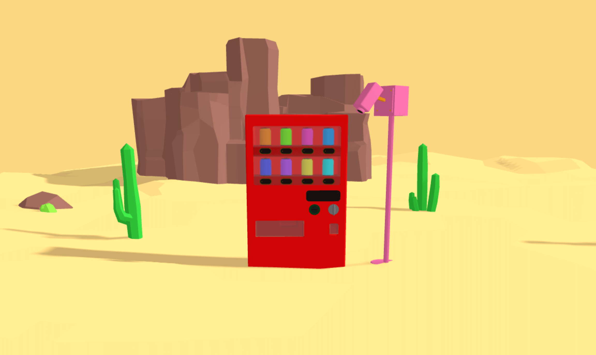

# 3D Vending Machine Project

## 🎯 프로젝트 소개

이 프로젝트는 이전에 [vending-machine-js](https://github.com/chiabi/vending-machine-js)를 만들었을때의 몰입했던 기억과 즐거운 경험을 되살려 Three.js로 재탄생 시킨 3D 자판기 프로젝트입니다. 사막 한가운데 놓인 빨간 자판기를 통해 현실과 상상의 경계를 넘나드는 재미를 느껴보세요. 완벽한 시뮬레이션은 아니지만, 이 프로젝트는 사용자와의 상호작용을 통해 웹 기술의 무한한 가능성을 탐험하는 작은 모험입니다. 선인장과 바위가 있는 황량한 배경 속에서, 이 특별한 자판기가 어떤 놀라운 경험을 선사할 지 함께 탐험해보세요!

## 🚀 주요 기능

- Three.js를 이용한 3D 자판기 모델 렌더링
- (개발 예정) 동전 투입, 음료 선택, 음료 배출 등의 인터랙티브 애니메이션

## 🛠 기술 스택

- [Vite](https://vitejs.dev/) - 빠른 프론트엔드 빌드 도구
- [Three.js](https://threejs.org/) - 3D 그래픽 라이브러리
- [React](https://reactjs.org/) - 사용자 인터페이스 구축
- [TypeScript](https://www.typescriptlang.org/) - 정적 타입 지원

## 🔮 향후 계획

- 세부적인 사용자 상호작용 추가 (동전 투입, 버튼 누르기 등)
- 물리 엔진을 활용한 실제 음료 낙하 시뮬레이션
- VR 지원을 통한 몰입형 경험
